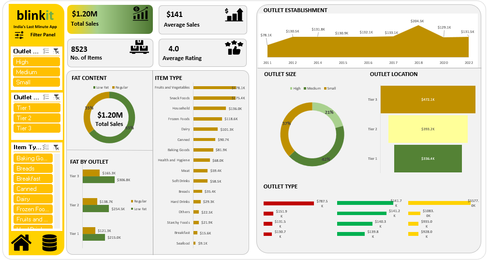

# 🛒 BlinkIT Grocery Sales Analytics Report — Excel

This repository contains a complete **BlinkIT Grocery Sales Analytics Report built entirely in Microsoft Excel**.  
The report analyzes BlinkIT grocery sales data using **Power Query (ETL), PivotTables, PivotCharts, Excel Data Model, and interactive slicers**.  
It uncovers insights about **sales KPIs, item categories, fat content, outlet size, outlet tiers, outlet types, and yearly establishment trends**.

---

## 🖼️ Report Preview

---

## 🗂️ Project Files

| File Name | Description |
|----------|-------------|
| **BlinkIT_Grocery_Data_Excel_Report.xlsx** | Excel workbook containing data cleaning (ETL), pivot tables, pivot charts, and final report |
| **BlinkIT_Report_Snapshot.png** | Snapshot of the BlinkIT Grocery Sales Analytics report |
| **README.md** | Project documentation |

---

## 🎯 Objective

To analyze BlinkIT grocery sales and derive insights related to:

- Total Sales  
- Average Sales  
- Number of Items  
- Average Rating  
- Item Type Contribution  
- Fat Content Split  
- Outlet Size Impact (Small / Medium / High)  
- Outlet Location Type (Tier 1 / Tier 2 / Tier 3)  
- Outlet Type Insights  
- Outlet Establishment Trend (2011–2022)

This Excel report supports retail and FMCG decision-making.

---

## ⭐ Key Performance Indicators (KPIs)

- **$1.20M — Total Sales**  
- **$141 — Average Sales**  
- **8,523 — No. of Items**  
- **4.0 ⭐ — Average Rating**

---

## 📊 Major Insights From the Report

### 🔹 1. Fat Content Analysis
- **65%** of sales come from **Regular Fat** items  
- **35%** from **Low Fat** items  

### 🔹 2. Item Type Contribution
Highest-selling categories:
- Fruits & Vegetables  
- Snack Foods  
- Household Items  
- Frozen Foods  
- Dairy  
- Health & Hygiene Products  
- Beverages  
- Starchy Foods  

### 🔹 3. Fat by Outlet (Tier-wise)
- **Tier 3** outlets contribute the highest fat-content sales  
- **Tier 2** shows balanced performance  
- **Tier 1** contributes the least among tiers

### 🔹 4. Outlet Establishment (Year-wise Performance)
Line chart shows outlet sales over years:
- Growth trend from **2011** to **2022**  
- Peak seen around **2018**

### 🔹 5. Outlet Size Distribution
Sales share by outlet size:
- **Medium — 42%**  
- **Small — 37%**  
- **High — 21%**

### 🔹 6. Outlet Location (Tier)
Sales by Tier:
- **Tier 3 → $471.1K**  
- **Tier 2 → $393.2K**  
- **Tier 1 → $386.4K**

### 🔹 7. Outlet Type Analysis
Sales contribution by store types such as:
- Grocery Stores  
- Supermarket Type 1  
- Supermarket Type 2  

---

## 🔍 Interactive Elements (Excel)

This report uses:

- **PivotTables** for calculations  
- **PivotCharts** for visual breakdowns  
- **Slicers** for interactive filtering  
  - Outlet Size  
  - Tier (1 / 2 / 3)  
  - Item Type  
  - Fat Content  
  - Establishment Year  
  - Outlet Type  
- **Power Query** for data cleaning  
- **Data Model (if enabled)** for relationships

---

## 🛠️ Tools & Techniques Used

### ✔ Microsoft Excel
- PivotTables  
- PivotCharts  
- Slicers  
- Timelines  
- Data Model  
- Conditional Formatting  

### ✔ Power Query (ETL)
- Data cleaning  
- Data transformation  
- Removing nulls  
- Column standardization  

---

## ▶️ How to Use the Report

1. Download the Excel file:  
   **BlinkIT_Grocery_Data_Excel_Report.xlsx**
2. Open in **Microsoft Excel (Windows recommended)**  
3. Enable **Editing** and **Data Connections**  
4. Use slicers to interact with item types, outlet tiers, sizes, and establishment years  
5. Refresh data using **Data → Refresh All**  

---

## 📌 Notes

- **100% Excel-based project** (no Power BI used).  
- Dataset is safe and created for analytics/portfolio purposes.  
- Visual theme uses BlinkIT-inspired colors (Yellow, Black, Green).  

---

## 👤 Author

**Nalgar Ahmed Faheen**  
📧 Email: **ahmedfaheen546@gmail.com**  
🔗 LinkedIn: **https://www.linkedin.com/in/nalgar-ahmed-faheen-2a28b022a**
